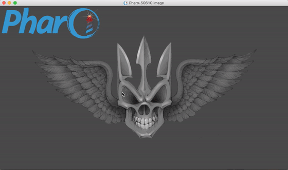

GitHubcello
===========
This project helps you to work with GitHub and Metacello.

Have it happened to you that you have your project on GitHub and it has a baseline but now you have to write down the Metacello script to load it? **Not any more!** Simply paste your repo URI into GTSpotter, _wait a bit_, select the baseline you want to load, and you're done!

###Limitations (for now)

- Works only for repos where baseline package is in the root.
- Does not support any special URIs (with queries, branches and so on).

Creating Baseline Fast
----------------------

If you just need a baseline for one of your packages select **Create Baseline** from the Nautilus' package context menu.
